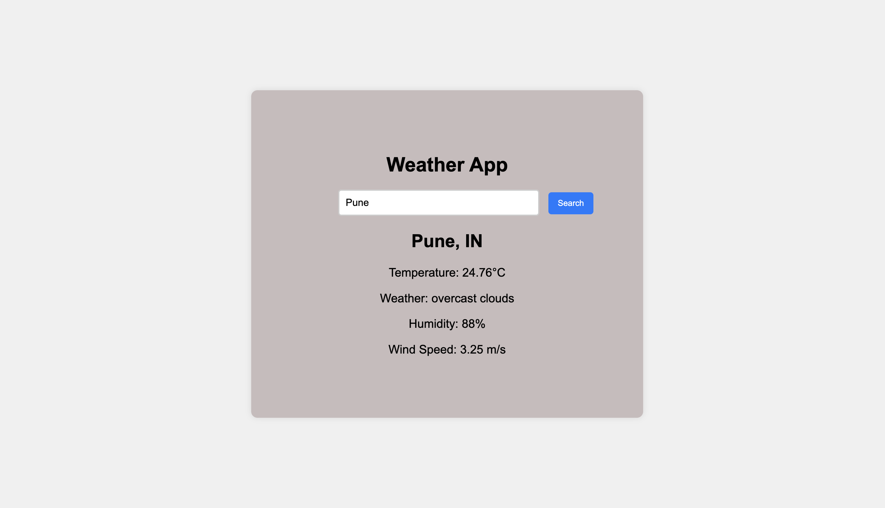

<!DOCTYPE html>
<html lang="en">
<head>
    <meta charset="UTF-8">
    <meta name="viewport" content="width=device-width, initial-scale=1.0">
</head>
<body>
    

        <h1>🌦️ Weather Application</h1>
        
Welcome to the Weather Application! This project allows users to check real-time weather information for any city worldwide. Built with modern web technologies, this application provides an intuitive and user-friendly interface.

        <h2>🚀 Features</h2>
        <ul class="features-list">
            <li>Real-time weather data</li>
            <li>Search functionality by city name</li>
            <li>Responsive design for mobile and desktop</li>
            <li>Displays temperature, humidity, wind speed, and more</li>
            <li>Background images that change based on weather conditions</li>
        </ul>
        <h2>🛠️ Installation</h2>
        
Follow these steps to set up the Weather Application on your local machine:

        <ul class="installation-steps">
            <li>Clone the repository: <code class="code-block">git clone https://github.com/your-username/weather-app.git</code></li>
            <li>Navigate to the project directory: <code class="code-block">cd weather-app</code></li>
            <li>Install dependencies: <code class="code-block">npm install</code></li>
            <li>Start the application: <code class="code-block">npm start</code></li>
        </ul>
        <h2>📷 Screenshots</h2>
        
Check out some screenshots of the application:

        
        <h2>💻 Usage</h2>
        
Once the application is running, enter a city name in the search bar to get the current weather details. The background image will change according to the weather conditions of the searched location.

        <h2>🔗 API Reference</h2>
        
This application uses the OpenWeatherMap API to fetch weather data. You can sign up for a free API key <a href="https://openweathermap.org/api" target="_blank">here</a>.

        <h2>🤝 Contributing</h2>
        
Contributions are welcome! Feel free to fork this project and submit a pull request. Please make sure to follow the <a href="CONTRIBUTING.md">contributing guidelines</a>.

        <h2>📄 License</h2>
        
This project is licensed under the MIT License. See the <a href="LICENSE.md">LICENSE</a> file for more details.

        
<a href="https://weather143.netlify.app/" class="btn">View on GitHub</a>

    

</body>
</html>
